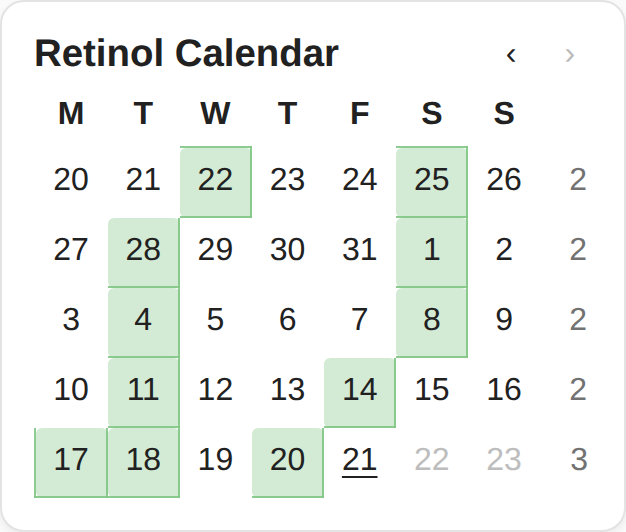

# Retinol Calendar Card

A minimal Home Assistant dashboard card that shows which days retinol was
used, based on events in a calendar entity. A replacement for the built-in
calendar card when all you want is "which days did I do it".



## The after-midnight rule

Logs made in the small hours belong to the evening before. Any event starting
before the cutoff hour (default 07:00 local time) is counted on the previous
day, so a log at 00:12 on 21 August is shown on 20 August.

## Features

- Rolling window of the last N weeks (default 5), Monday-start rows
- Per-week count column on the right
- Back and forward arrows to page through history, with a Today button
- Today underlined, future days greyed out
- Follows your Home Assistant theme

## Installation (HACS)

1. HACS > three-dot menu > **Custom repositories**
2. Add this repository's GitHub URL, category **Dashboard**
3. Install **Retinol Calendar Card** and reload when prompted

Manual alternative: copy `retinol-calendar-card.js` to `config/www/` and add
`/local/retinol-calendar-card.js` as a dashboard resource (type: module works,
plain JavaScript is fine too).

## Card configuration

```yaml
type: custom:retinol-calendar-card
entity: calendar.skincare
```

| Option        | Default             | Description                                            |
| ------------- | ------------------- | ------------------------------------------------------ |
| `entity`      | `calendar.skincare` | Calendar entity to read events from                    |
| `weeks`       | `5`                 | Weeks shown in the rolling window (1-12)               |
| `cutoff_hour` | `7`                 | Events starting before this hour count as previous day |
| `title`       | `Retinol Calendar`  | Card title                                             |

Every event on the calendar is counted; there is no title filtering. Point it
at a calendar that only receives your retinol logs.

### Theming

Two CSS variables override the highlight colour:

```yaml
retinol-highlight: "rgba(129, 199, 132, 0.35)"
retinol-highlight-border: "rgba(129, 199, 132, 0.9)"
```

## All-day events

The cutoff rule needs a start time, so it cannot apply to all-day events.
Those are counted on their own date and the card shows a small notice.

## Development

`test/harness.html` renders the card outside Home Assistant with mocked
events, including the after-midnight and cutoff-boundary cases. Open it in a
browser; the expected results are listed beside the card.

## Licence

MIT
